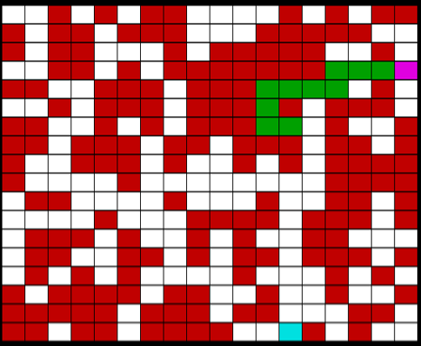
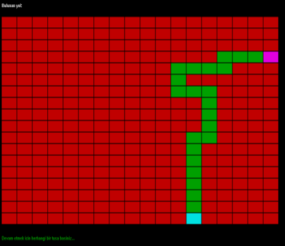

# Maze Game

## Description
This program; The nxn dimensional, n value creates random paths and walls on a matrix entered by the user and by using the list and stack structure connected to this random path and walls, it finds out whether there is a path between the input and output doors entered by the user. If the road is not found, the user is informed that the road is not found, if the road is found; the path found is shown to the user.

## Dependency

This program uses C Graphics.h library.

## Usage

Clone and run with Graphics.h library on CodeBlocks, DevC++ etc. Just that simple :)

## Contributing
Pull requests are welcome. For major changes, please open an issue first to discuss what you would like to change.

Please make sure to update tests as appropriate.

## Authors
:bust_in_silhouette: [Mehmet Fırat KÖMÜRCÜ](https://github.com/MehmetFiratKomurcu)

:bust_in_silhouette: [Ali Recep KARACA](https://github.com/recepkaraca)

## Project Status

This is our school project.
